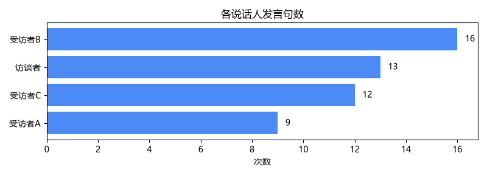
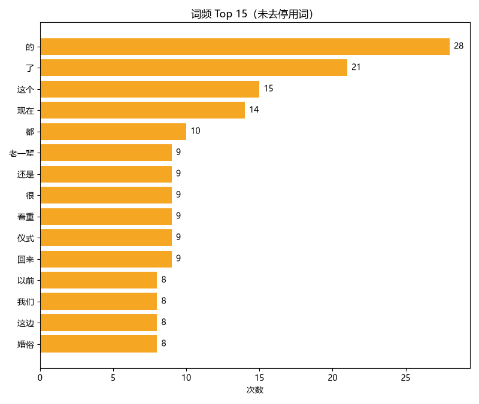

# 访谈文本分析（Interview Text Analysis）

用 Python 分析访谈语料：读取 → 分词 → 词频统计 → 可视化。

这是我转行数据分析的第一个练习项目，重点是把「**原始数据 → 清洗 → 分析 → 结论**」这条完整链路亲手跑通。

---

## 📌 我想回答的问题

1. 每份访谈里，各位受访者的发言量是否均衡？有没有人被明显忽略？
2. 访谈语料里出现频率最高的词是哪些？去掉无意义的停用词（「的」「了」「是」）之后，真正的主题词是什么？
3. （待补充）不同受访者关注的话题有没有差异？

---

## 📊 数据来源

| 项目 | 说明 |
|---|---|
| 来源 | `src/make_fake_data.py` **程序生成**的模拟语料 |
| 规模 | 50 条记录，3 个字段（id / speaker / text） |
| 字段说明 | `id` 记录编号；`speaker` 说话人；`text` 发言内容 |
| ⚠️ 局限性 | **目前是假数据**，用于跑通技术流程。下一步要替换成真实访谈语料 |

> 用假数据起步是有意为之：把「技术问题」和「数据问题」分开解决，排错时不会两种问题混在一起。

---

## 🔧 技术栈

- Python 3.12
- pandas（待接入）
- **jieba** —— 中文分词（中文词之间没有空格，`split()` 切不开）
- matplotlib + seaborn —— 可视化
- csv / collections —— 基础数据处理

---

## 🚀 怎么运行

```bash
# 1. 创建虚拟环境（首次）
py -m venv .venv

# 2. 安装依赖
.venv\Scripts\pip install -r requirements.txt

# 3. 生成测试数据
.venv\Scripts\python src\make_fake_data.py

# 4. 运行分析并出图
.venv\Scripts\python src\day1.py
```

**Windows 用户也可以直接双击** `运行day1.bat`。

---

## 📁 文件结构

```
interview-analysis/
├── README.md
├── requirements.txt        ← 依赖清单
├── 运行day1.bat            ← 双击运行的启动器
├── 打开命令行.bat          ← 双击打开已定位好的终端
├── exercises_D1.md         ← 练习与思考记录
├── src/
│   ├── make_fake_data.py   ← 生成模拟访谈语料
│   └── day1.py             ← 主脚本：读取→统计→分词→出图
├── data/
│   └── interviews.csv      ← 数据
└── output/                 ← 生成的图表
    ├── speaker_count.png
    └── word_freq.png
```

---

## 🔍 数据处理要点

- **编码**：读写用 `utf-8-sig`，否则 Excel 打开中文会乱码
- **中文分词**：必须用 `jieba.lcut()`，`split()` 对中文无效
- **中文字体**：绘图必须设置 `plt.rcParams["font.sans-serif"]`，否则图里全是方框

---

## 📈 分析结果

### 图 1：各说话人发言句数



从图中可以看出各位说话人的发言量分布。

### 图 2：词频 Top 15（未去停用词）



某次运行的词频 Top 10 实测结果：

```
的:28 | 了:21 | 这个:15 | 现在:14 | 都:10 | 老一辈:9 | 还是:9 | 很:9 | 看重:9 | 仪式:9
```

**前 5 名全是虚词**（的、了、这个、现在、都），真正有意义的主题词（老一辈、仪式、看重）被压在下面 —— **这直接说明下一步必须做停用词过滤，否则词频分析没有实际意义。**

> ⚠️ 注意：数据由脚本随机生成，每次重新运行数字会变，但「虚词霸榜」这个结论稳定成立。

---

## 💡 结论

1. **词频分析不去停用词 = 无效分析**。实测前 5 名全是「的/了/这个/现在/都」这类虚词，对理解访谈主题毫无帮助。
2. **中文文本分析的第一步不是分析，是分词**。中文没有天然空格分隔，分词质量直接决定后续所有结果。
3. **数据可视化必须解决中文字体问题**，否则图表无法交付给人看。

### 下一步计划

- [ ] 加入停用词表，过滤「的/了/是/我」等虚词
- [ ] 按说话人分组做词频对比
- [ ] 替换成真实访谈语料（田野调查资料）
- [ ] 引入 pandas 重构，提升数据处理效率

---

## ⚠️ 局限与改进

- 数据是模拟生成的，**结论不具备实际研究价值**，本阶段只验证技术流程
- 分词用的是 jieba 默认词典，**没有针对访谈场景做自定义词典**，专业词汇可能被切错
- 只做了词频统计，**没有做语义分析**（主题建模、情感分析等）

---

## 📝 我在这个项目里学到什么

- **中文分词的坑**：先用 `split()` 试，发现切不开，才理解为什么需要 jieba
- **编码的坑**：`utf-8` 写出的 CSV 在 Excel 里是乱码，必须用 `utf-8-sig`
- **字体渲染的坑**：matplotlib 默认不支持中文，必须显式指定字体
- **虚拟环境的意义**：每个项目独立环境，避免依赖冲突
- **工程规范**：`.gitignore` 排除 `.venv`，`requirements.txt` 记录依赖
